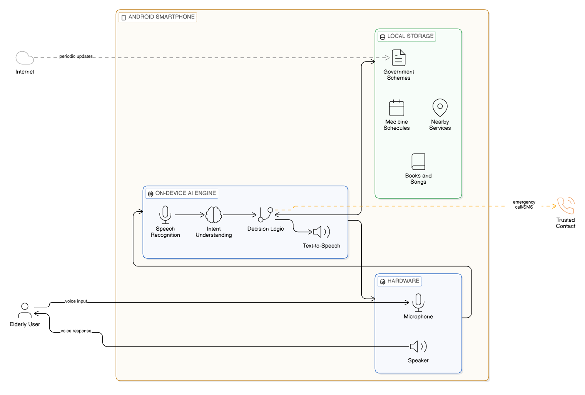
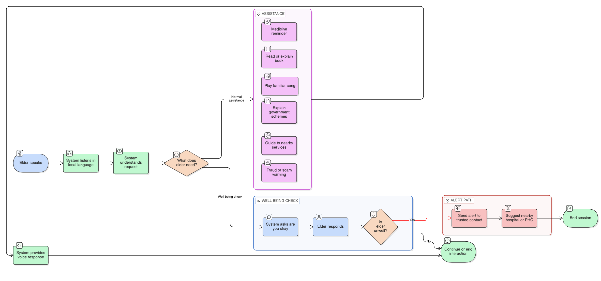

# ElderConnect

**ElderConnect** is an offline, voice-first elder care application designed to support elderly users—especially in rural areas—with daily care, safety, and essential services.

---

## 🧩 Problem Statement
Many elderly people struggle with smartphones due to low literacy, language barriers, fear of scams, and poor or no internet connectivity. Existing AI assistants depend heavily on cloud services and are not designed for elderly users.

---

## 💡 Proposed Solution
ElderConnect provides a standalone Android application that works completely offline and allows elderly users to interact using voice in local languages. The app focuses on trust, simplicity, and privacy.

---

## ⭐ Key Features
- Voice-only interaction in local languages
- Fully offline operation on low-cost Android phones
- Daily well-being check-ins
- Medicine guidance and reminders
- Fraud and scam call warnings
- Alerts sent to trusted contacts with user consent
- Government schemes and nearby services guidance
- Offline books reading and devotional songs for companionship
- Privacy-first, on-device processing (no cloud)

---

## 🔧 How It Solves the Problem
By removing internet, literacy, and trust barriers, ElderConnect enables elderly users to live more independently while staying safe and connected.

---

## 🛠️ Technologies Used
- Android OS
- On-device Speech Recognition (ASR)
- Text-to-Speech (TTS)
- Rule-based NLU
- SQLite (offline storage)
- Android Telephony & SMS APIs

---
---

## 🧩 AMD Technologies & Solutions Alignment

This project aligns with AMD’s vision for **edge and on-device AI computing**.

- **AMD Ryzen™ Processors** were used during development and testing for building, simulating, and validating the offline voice-based application.
- The solution follows an **edge AI approach**, where all processing happens locally on the device without relying on cloud services.
- This design demonstrates how **AMD-powered systems support privacy-first, low-latency, and offline AI solutions**, especially for use cases in low-connectivity environments.

By avoiding cloud dependency and enabling on-device intelligence, ElderConnect reflects AMD’s focus on efficient, secure, and scalable edge computing solutions.

---

## 🧠 System Architecture

---

## 🔄 User Flow

---

## 🎨 Prototype
The UI/UX prototype is designed using a visual prototyping tool to demonstrate user flow and interaction.

---

## 📄 Presentation
The project presentation is available in the `ppt/` folder.

---

## 📌 Note
This repository represents a **functional prototype and system design** for an offline, on-device AI-based elder care solution.